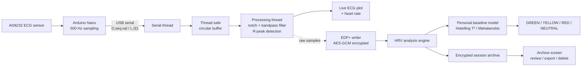

<div align="center">

# Pure-Trace

**An engineering case study in patient-specific cardiac anomaly detection**
Analog & embedded hardware · signal processing · applied statistics · encrypted health data · concurrent systems

[](https://www.python.org/)
[](https://www.raspberrypi.com/)
[](./LICENSE)
[](#️-disclaimer)

`analog-frontend` · `embedded-firmware` · `signal-processing` · `applied-statistics` · `cryptography` · `concurrent-systems` · `emc-shielding` · `desktop-ui`

</div>

<p align="center">
  <!--
    Suggested hero image: a photo of the assembled device (Raspberry Pi +
    touchscreen + Arduino/AD8232 + enclosure) running the acquisition screen.
    docs/screenshots/hero.png — 1200px wide recommended.
  -->
  
</p>

---

## ⚠️ Disclaimer

> **Pure-Trace is a research prototype. It is not a medical device and must
> not be used for diagnostic purposes.** It reports statistical deviations
> from a patient's own historical baseline — it does not diagnose any
> medical condition.

---

## What this is

Pure-Trace is a complete, working system spanning two layers that are
usually built and shown separately: a **physical acquisition device** —
analog front-end, embedded firmware, custom enclosure, power and shielding
design — and a **software pipeline** built on top of it — real-time signal
processing, an applied-statistics scoring model, and an encrypted desktop
application. It was built to answer one specific engineering question: *can
a low-cost single-lead ECG setup detect meaningful, patient-specific
deviations in cardiac variability, end to end, with the same rigor a
production system would need — from the electrode on skin to the number a
clinician reads?*

This README documents **what was built and why**, not how to set it up —
the goal is to make the reasoning behind each decision legible, not to hand
over a plug-and-play package.

## The idea

Commercial wearables flag "abnormal" heart rate variability against
population-wide thresholds — the same cutoff for everyone, regardless of a
person's own baseline physiology. Pure-Trace explores a different approach:
build a **personal, per-patient statistical model** instead, and measure how
much a new recording deviates from *that specific person's own history*
rather than from a population average.

The differentiator is deliberately **not** the hardware. The statistical
layer — feature extraction, per-patient Mahalanobis baseline, Hotelling T²
calibration — is designed to be agnostic to whatever ECG front-end feeds it;
any certified sensor could sit in place of the Arduino/AD8232 used here
without changing the algorithm. Two architectural choices reflect that
intent:

- **Raw signal fidelity is never touched.** Filtering is only ever used for
  on-device display and feature extraction — every export is always the
  unprocessed raw signal, so nothing is lost to on-device processing before
  the data reaches a clinician.
- **Local-first, no-cloud data model.** Every artifact is encrypted and kept
  on the device itself, and sessions export to EDF+, a standard clinical
  format independent of this software.

The hardware side exists to make that idea physically real and physically
*safe* — hence the amount of attention given below to power isolation,
shielding, and failure handling, not just to the statistics.

### Device-free UI testing

Set `DEBUG=1` before launching the application to inject a protocol-compatible
Arduino/AD8232 mock. It streams a synthetic 72 bpm ECG and reports connected
electrodes, so recording, live rendering, signal processing, saving, and the
archive all use the same path as the physical device. The mode is opt-in and
must never be used for clinical or sensor validation.

PowerShell:

```powershell
$env:DEBUG = '1'
python -m pure_trace.main
```

## Screenshots

<!--
  Replace the placeholders below with real screenshots once available.
  Suggested shots (docs/screenshots/):
    - device_enclosure.png  -> assembled device, enclosure + shielding baffle
    - profile_login.png     -> profile selector + password screen
    - acquisition_live.png  -> live ECG trace + heart rate during a recording
    - archive_list.png      -> session list with status colors
    - session_detail.png    -> full trace + colored RR strip + metrics grid
-->

<table>
  <tr>
    <td align="center"><b>Assembled device</b></td>
    <td align="center"><b>Login / profile selection</b></td>
  </tr>
  <tr>
    <td></td>
    <td></td>
  </tr>
  <tr>
    <td align="center"><b>Live acquisition</b></td>
    <td align="center"><b>Session archive</b></td>
  </tr>
  <tr>
    <td></td>
    <td></td>
  </tr>
</table>

---

## Table of contents

- [Skills & concepts applied](#skills--concepts-applied)
- [Hardware engineering deep dives](#hardware-engineering-deep-dives)
- [Software engineering deep dives](#software-engineering-deep-dives)
- [Architecture](#architecture)
- [Design for compliance & patient safety](#design-for-compliance--patient-safety)
- [Privacy & data model](#privacy--data-model)
- [Bill of materials](#bill-of-materials)
- [Tech stack](#tech-stack)
- [Project structure](#project-structure)
- [Production-readiness considerations](#production-readiness-considerations)
- [Full documentation](#full-documentation)

---

## Skills & concepts applied

| Domain | Where it shows up in this project |
|---|---|
| **Analog front-end & power electronics** | Battery-only power delivery for galvanic isolation, boost-converter selection and sizing, hardware high-pass filtering and lead-off detection on the AFE |
| **EMC / signal integrity** | Diagnosing switching-converter EMI coupling onto a flex display cable; designing and building a directional copper shield to attenuate it |
| **Embedded firmware** | Non-blocking serial I/O, drift-free timing via `micros()`, a fault-tolerant serial protocol with sequence numbers |
| **Digital signal processing** | Real-time IIR notch + bandpass filtering with persistent filter state, adaptive R-peak detection, offline vs. streaming filter equivalence |
| **Applied statistics** | Multivariate outlier detection (Mahalanobis distance), correct small-sample calibration (Hotelling T² instead of χ²), robust (median/MAD) z-scoring |
| **Applied cryptography** | AES-GCM authenticated encryption, PBKDF2 key derivation, side-channel-aware design (padding to hide plaintext length) |
| **Concurrent systems** | Producer/consumer threading (serial ↔ processing ↔ UI), a thread-safe circular buffer, a lock-free O(1) sliding-window maximum |
| **Resilient systems design** | Atomic file writes, crash-safe multi-step operations, explicit "missing vs. corrupted" data handling, hardware-level fault detection (leads-off, dropped frames, power loss) |
| **Applied UX & mechanical design** | A touch-first interface for a fixed 800×480 embedded display; a custom 3D-printed enclosure (7×6×3 cm) housing all of the above |

---

## Hardware engineering deep dives

The physical layer wasn't treated as a commodity part to buy and forget —
it's where most of the safety and reliability constraints of the project
actually live. Each of these is a real constraint that shaped a design
decision, not a spec pulled from a datasheet.

### 1. Choosing battery-only power for galvanic isolation

**Problem.** Any device with electrodes touching a patient's skin is a
shock hazard if it's connected, even indirectly, to mains power. This is the
central concern IEC 60601-1 is built around.

**Why the obvious approach is risky.** Powering the device from a USB wall
adapter would be simpler to build and to keep charged, but it ties the
patient's skin, through the device, to the electrical grid — exactly the
path a fault (in the adapter, in the mains wiring, anywhere) could use to
deliver a shock.

**What was done.** The system runs exclusively on an internal 5000 mAh Li-Po
battery through an IP5328P boost converter (18 W), and the device is
hardware-locked to be unusable while charging. This gives strict, physical
galvanic isolation between the patient and the power grid — a property that
doesn't depend on software or configuration to hold, which is the point.

*(Power architecture; see [Bill of materials](#bill-of-materials) for the
specific components.)*

### 2. Tracing an EMI problem to its physical cause

**Problem.** With the device assembled, the display connected via a MIPI
DSI flex cable began showing intermittent visual noise correlated with
battery load — not a software bug, since it appeared and disappeared with
power draw, not with any code path.

**Why it wasn't obvious at first.** DSI cables are unshielded by design and
run close to other components inside a compact 7×6×3 cm enclosure. The
suspect wasn't immediately the boost converter — that took process of
elimination (isolating subsystems, checking correlation with the converter's
switching activity specifically) rather than a first guess.

**What was done.** The IP5328P boost converter switches at 300 kHz–1 MHz,
radiating magnetic interference directly onto the adjacent flex cable. A
custom-built, grounded **Shielding Baffle** — a small directional Faraday
cage made from copper tape — was placed between the inductor and the cable
to attenuate line-of-sight EMI, resolving the display artifacts. This is the
kind of fault that has no line in a datasheet; it only shows up once real
parts are physically close together, which is exactly why it's worth
documenting.

### 3. Rejecting the noise that shielding can't stop

**Problem.** Even with the display cable shielded, the ECG *signal itself*
still picks up interference — but from a different source and through a
different path than the DSI cable issue above.

**Why it's a different problem.** The electrode leads run externally, off
the device, acting as antennas for ambient 50 Hz mains hum from the
surrounding environment. No amount of shielding inside the enclosure fixes
noise picked up by cables that are, by necessity, outside it.

**What was done.** This is handled downstream in software rather than in
hardware: a digital IIR notch filter (Q=30) tuned to 50 Hz removes it from
the acquired signal. Put together with deep dive #2, the EMC strategy has
two distinct halves — physical shielding for internally-generated,
short-range interference, and digital filtering for externally-picked-up,
narrowband interference — chosen because each technique fits the failure
mode it's actually solving, not applied uniformly everywhere.

*(`signal_processing.py`, notch filter stage — see also
[Software deep dive #2](#2-deciding-what-signal-fidelity-actually-means).)*

### 4. Designing firmware for a link that will drop samples

**Problem.** The Arduino streams 500 samples/second over USB serial to a
Raspberry Pi that is also running UI rendering and DSP in parallel — a
combination that can occasionally cause the receiving side to fall behind.

**Why silent drops are worse than the drops themselves.** If a sample is
lost and nothing marks that it happened, the timebase downstream quietly
drifts — every RR-interval computed after that point is subtly wrong, and
there's no way to tell from the data alone that it happened.

**What was done.** The firmware keeps a running sequence counter on every
sample sent, using non-blocking serial I/O and `micros()`-based timing to
avoid ever stalling the ADC loop to wait on a slow write. On the receiving
side, a gap in the sequence is detected and interpolated explicitly, so a
dropped sample becomes a known, corrected event instead of a silent,
invisible one. This is the firmware half of a problem that's really about
honesty in the data — see also
[software deep dive #4](#4-treating-no-data-and-corrupted-data-as-different-failure-modes)
for the same principle applied to storage.

*(`firmware/pure_trace_firmware.ino`.)*

---

## Software engineering deep dives

Each of these started as a bug, a wrong assumption, or a "this works but is
it actually correct?" moment. They're the parts of the codebase worth
reading for.

### 1. Calibrating the baseline thresholds correctly, not just plausibly

**Problem.** A new session is flagged `RED` if it's statistically far from
the patient's historical baseline. The obvious way to define "far" is a χ²
threshold on the Mahalanobis distance — that's the textbook formula when
mean and covariance are *known*.

**Why the obvious approach is wrong here.** They aren't known — they're
*estimated* from a handful of previous sessions per patient. Plugging
estimated parameters into a formula that assumes they're exact understates
the real uncertainty. Measured against the intended 1% false-positive rate,
the naive χ² threshold produced roughly **20% false `RED` classifications**
at typical early sample sizes (n≈5) — a model that would cry wolf on a
healthy patient one time in five.

**What was done.** Replaced it with two-sample Hotelling T² theory, which
accounts for the fact that the reference distribution itself is estimated:
the distance is rescaled and compared against an F-distribution with degrees
of freedom tied to the number of sessions and features, only activating once
there are enough sessions for those degrees of freedom to be valid.

*(`analysis_engine.py`, `BaselineModel`; reasoning also documented inline in
`config.py`.)*

### 2. Deciding what "signal fidelity" actually means

**Problem.** The real-time R-peak detector fires on the first sample that
crosses an adaptive threshold — not on the true peak of the R-wave.

**Why it matters.** That lag isn't constant: R-wave amplitude is modulated
by respiration, so the detection lag varies breath to breath. RMSSD, the HRV
metric most sensitive to beat-to-beat variation, picks that variation up
directly as if it were physiological — it isn't, it's a detector artifact.

**What was done.** Offline analysis re-locates every detected peak to its
true local maximum before computing any metric ("apex snapping"). Measured
effect: RMSSD error dropped from roughly **+5% to +1%**. This clarified a
broader design principle applied throughout the project: filtering and
detection are allowed to be approximate for *display* purposes, but never
for anything that feeds a number the clinician will actually read — and the
raw signal that gets exported is never touched by any of this in the first
place (see [The idea](#the-idea)).

*(`analysis_engine.py`, `_snap_to_apex`.)*

### 3. Not leaking data through metadata

**Problem.** Every derived artifact — the per-beat classification, the HRV
feature file — is AES-GCM encrypted. Encryption hides content. It does
**not** hide length.

**Why it matters.** The per-beat colormap has one byte per heartbeat. Its
file size on disk, without decrypting a single byte, directly reveals beat
count — and therefore average heart rate — to anyone with access to the
storage medium.

**What was done.** Every payload is padded to a fixed block size before
encryption, so ciphertext length stops correlating with the number of
recorded beats. It's a small addition, but it's the difference between "the
data is encrypted" and "the data is actually private."

*(`secure_store.py`, `_pad`/`_unpad`.)*

### 4. Treating "no data" and "corrupted data" as different failure modes

**Problem.** A read helper that returns a sensible default when a file is
missing is convenient — until the same fallback also fires for a file that
exists but fails to decrypt (wrong key, bit rot, partial write).

**Why it matters.** For most files, silently treating "corrupted" as "empty"
is harmless. For the baseline file specifically, it is not: the analysis
pipeline would interpret a decrypt failure as "no baseline yet," rebuild an
empty pool, and **overwrite months of patient history** with it — a data-loss
bug that is invisible until someone notices the baseline "reset itself."

**What was done.** The baseline reader uses a strict mode that raises an
explicit, distinguishable error on decrypt failure instead of degrading to a
default; scoring is disabled until the problem is resolved, and the file is
never rewritten in that state. Every other (lower-stakes) read in the app
still degrades gracefully — this is a deliberate exception, not a global
policy change.

*(`secure_store.py`, `read_json(strict=True)`; `analysis_engine.py`,
`_load_model`.)*

### 5. Real-time performance on hardware that doesn't have much to spare

**Problem.** R-peak detection needs the maximum value in a sliding window,
recomputed on every incoming sample, on a Raspberry Pi.

**Why the obvious approach doesn't scale.** Recomputing `max()` over the
window on every sample is O(window size) per sample — at 500 Hz with a
1-second window, that's a real, measurable amount of wasted CPU on
constrained hardware, and it compounds with everything else the UI thread
needs to do to stay responsive.

**What was done.** A monotonic deque gives an O(1) amortized sliding-window
maximum. The same performance-first mindset shows up elsewhere: offline
filtering processes an entire session as one array operation instead of
looping sample-by-sample (~2000x faster, same numerical result), and
acquisition is split across three cooperating threads — serial I/O,
DSP/detection, and UI rendering — so none of them can stall another.

*(`signal_processing.py`, `RPeakDetector._window_max`, `DigitalFilter`.)*

### 6. Assuming the field will go wrong, because it will

**Problem.** This runs on a Raspberry Pi that can lose power mid-write, an
Arduino connected over a USB cable that can disconnect mid-session, and a
serial link that can drop samples under load — with, potentially, no
technician nearby when it happens.

**What was done, concretely:**
- The gap-interpolation logic described in
  [hardware deep dive #4](#4-designing-firmware-for-a-link-that-will-drop-samples)
  keeps the RR-interval timebase from drifting quietly when samples are lost.
- Every file write (a new patient profile, a session, the baseline) goes to
  a temp file, is `fsync`'d — file *and* containing directory — then
  atomically renamed, so a power loss never leaves a half-written file
  where a good one should be.
- Profile creation builds the entire profile in a hidden staging directory
  and only renames it into place once complete, so an interrupted creation
  can't leave a half-built profile that crashes the login screen later.

None of these are exotic techniques. What they demonstrate is the habit of
asking "what happens if this specific operation is interrupted halfway
through?" for every operation that touches disk or a wire — hardware and
software alike.

---

## Architecture



The AD8232 front-end amplifies the ECG signal and exposes a leads-off
status; the Arduino samples both at 500 Hz and streams them over serial with
a sequence counter. The desktop app filters the live signal for display and
detection only, while the raw trace is what actually gets saved. On stop,
the session is encrypted, written as EDF+, and analyzed offline: HRV metrics
are computed, checked against the patient's baseline once enough history
exists, and the result is archived alongside the recording. The battery,
boost converter, and shielding baffle from the
[hardware deep dives](#hardware-engineering-deep-dives) sit physically
upstream of block **A**, outside this data-flow diagram but load-bearing for
the whole system's safety.

## Design for compliance & patient safety

This prototype was designed *mimicking* the principles of IEC 60601-1 and
GDPR/HIPAA — it is not certified against either, but the design decisions
follow their logic:

| Concern | Standard's principle | How it's addressed here |
|---|---|---|
| Electric shock risk | IEC 60601-1 — patient must be isolated from mains | Battery-only power, hardware-interlocked against use while charging ([deep dive](#1-choosing-battery-only-power-for-galvanic-isolation)) |
| Radiated EMI | IEC 60601-1-2 — device must not corrupt its own signals | Grounded copper shielding baffle around the boost converter ([deep dive](#2-tracing-an-emi-problem-to-its-physical-cause)) |
| Conducted / ambient EMI | IEC 60601-1-2 | Digital 50 Hz notch filter (Q=30) ([deep dive](#3-rejecting-the-noise-that-shielding-cant-stop)) |
| Data confidentiality | GDPR/HIPAA — data at rest should be protected against unauthorized access | AES-128-GCM encryption + padding against metadata leakage ([deep dive](#3-not-leaking-data-through-metadata)) |
| Data integrity | GDPR/HIPAA — accidental loss should be mitigated | Atomic writes, strict corrupted-vs-missing handling ([deep dive](#4-treating-no-data-and-corrupted-data-as-different-failure-modes)) |

## Privacy & data model

Health data handling was treated as a first-class design constraint, not an
add-on:

- Each profile is password-protected (PBKDF2-HMAC-SHA256, 200,000
  iterations) → a profile-specific AES-128-GCM key; the password itself is
  never stored.
- The patient's real name, the raw ECG, HRV metrics, and the baseline model
  are all encrypted at rest. Only a non-identifying alias is ever shown
  before login.
- Exporting a session for external clinical tools produces a **plaintext**
  file by necessity — the app surfaces an explicit warning before doing so,
  since protection becomes the user's responsibility from that point on.

*(`secure_store.py`, `data_layer.py`.)*

## Bill of materials

The physical layer was kept deliberately low-cost, to validate the
statistical and data pipeline without waiting on certified hardware.

| Component | Function | Approx. cost |
|---|---|---|
| Raspberry Pi 4B (8 GB) | Compute unit, DSP & UI hosting | $75 |
| Arduino Nano (CH340) | 500 Hz ADC & serial streaming | $5 |
| AD8232 breakout | Analog signal conditioning & lead-off detection | $10 |
| Waveshare 4.3" MIPI DSI | 800×480 capacitive UI display | $40 |
| Li-Po battery (5000 mAh) | Internal power / galvanic isolation | $15 |
| IP5328P boost module | 3.7 V → 5 V power regulation (18 W) | $5 |

Housed in a custom 3D-printed enclosure (7×6×3 cm) with the copper shielding
baffle described in
[hardware deep dive #2](#2-tracing-an-emi-problem-to-its-physical-cause)
mounted between the boost converter and the display flex cable.

## Tech stack

`Python` · `PyQt5` + `pyqtgraph` (UI/plotting) · `NumPy` / `SciPy` (DSP) ·
`cryptography` (AES-GCM, PBKDF2) · `pyedflib` (EDF+ clinical format) ·
`pyserial` · `Arduino C++` (firmware)

## Project structure

```
pure-trace/
├── firmware/pure_trace_firmware.ino   # Arduino sketch (ECG front-end)
├── hardware/                          # enclosure CAD, shielding baffle, power notes
├── pure_trace/                        # application package
│   ├── main.py, config.py
│   ├── data_layer.py, secure_store.py       # profiles, encryption, EDF+
│   ├── analysis_engine.py                   # HRV analysis + baseline model
│   ├── signal_processing.py, serial_port.py # real-time DSP + serial I/O
│   ├── logging_setup.py
│   └── ui/                                  # PyQt5 screens + design system
├── tools/create_profile.py
├── docs/                              # full technical write-up + screenshots
└── requirements.txt
```

Full breakdown of every file, by responsibility, is in the
[technical documentation](#full-documentation).

## Production-readiness considerations

Built with hobbyist-grade parts on purpose, to validate the pipeline and the
statistical layer without waiting on certified hardware. What follows are
choices tied to *this specific build*, not to the underlying approach — a
production version would swap components rather than solve these in place:

- **Not a diagnostic tool** — reports relative deviations from a personal
  baseline, not medical conditions, by design.
- **This sensor isn't mV-calibrated.** The AD8232 used for the demo doesn't
  provide a calibrated analog output; the app states this explicitly rather
  than implying a precision the hardware doesn't have. A certified front-end
  would provide a calibrated signal with no change to the software
  downstream — the statistical layer only ever consumes derived features.
- **EMI shielding is bespoke, not certified.** The copper-tape baffle solves
  the specific coupling path observed in this enclosure; a production
  design would need formal EMC testing (radiated + conducted) rather than a
  single hand-built fix.
- **Secure deletion is a mitigation, not a guarantee** on SD/SSD media with
  wear leveling — a property of the storage medium, independent of the
  encryption scheme itself.

## Full documentation

A complete theory + code walkthrough (in Italian) is available in
[`docs/Pure-Trace_documentazione.md`](docs/Complete_Project_Documentation.md),
covering every design decision in the project — hardware and software — file
by file, in more depth than fits here.

---

<div align="center">

**Michele Bufis** · [LinkedIn](https://www.linkedin.com/in/michele-pasquale-bufis-7362242a0) · michelebufis2002@gmail.com

<sub>Built as a research prototype exploring analog/embedded hardware, signal processing, applied statistics, and secure data handling.</sub>

</div>
