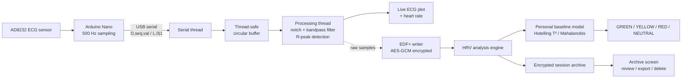

<div align="center">

# Pure-Trace

**A single-lead ECG acquisition and personal-baseline HRV analysis system**
Arduino front-end · PyQt5 touch application · encrypted patient data · statistical anomaly scoring

[](https://www.python.org/)
[](https://pypi.org/project/PyQt5/)
[](#getting-started)
[](./LICENSE)
[](#disclaimer)

</div>

<p align="center">
  <!--
    Suggested hero image: a photo of the assembled device (Raspberry Pi +
    touchscreen + Arduino/AD8232) running the acquisition screen.
    docs/screenshots/hero.png — 1200px wide recommended.
  -->
  
</p>

---

## ⚠️ Disclaimer

> **Pure-Trace is a research prototype. It is not a medical device and must
> not be used for diagnostic purposes.** It reports statistical deviations
> from a patient's own historical baseline — it does not diagnose any
> medical condition. The disclaimer is also shown explicitly in the app's
> login screen.

---

## About the project

Pure-Trace is a complete, end-to-end system — hardware, firmware, and desktop
application — for recording a single-lead ECG and turning it into a
personalized cardiac variability trend over time, instead of comparing it to
generic population thresholds.

It was built around three ideas:

1. **HRV (heart rate variability) is highly individual.** Instead of fixed
   thresholds, Pure-Trace learns *each patient's own* statistical baseline
   from their previous sessions and flags how much a new recording deviates
   from it.
2. **Field devices fail silently if you let them.** Serial disconnects,
   dropped samples, power loss mid-write, corrupted files — every one of
   these is handled explicitly instead of crashing the app or corrupting
   patient data.
3. **Health data deserves to be encrypted by default**, including derived
   data (HRV metrics, per-beat classification) that is easy to forget about,
   with care taken not to leak information through metadata like file size.

Full write-up of every design decision (in Italian) is available in
[`docs/Pure-Trace_documentazione.md`](docs/Pure-Trace_documentazione.md).

---

## Vision

Commercial wearables flag "abnormal" heart rate variability against
population-wide thresholds — the same cutoff for everyone, regardless of a
person's own baseline physiology. Pure-Trace explores a different idea:
build a **personal, per-patient statistical model** instead, and measure how
much a new recording deviates from *that specific person's own history*
rather than from a population average.

The differentiator is deliberately **not** the hardware. The statistical
layer — feature extraction, per-patient Mahalanobis baseline, Hotelling T²
calibration — is designed to be agnostic to whatever ECG front-end feeds it;
any certified sensor could sit in place of the Arduino/AD8232 used here
without changing the algorithm. Two architectural choices reflect that
intent:

- **Raw signal fidelity is never touched.** Filtering is only ever used for
  on-device display and feature extraction — every export is always the
  unprocessed raw signal, so nothing is lost to on-device processing before
  the data reaches a clinician.
- **Local-first, no-cloud data model.** Every artifact is encrypted and kept
  on the device itself, and sessions export to EDF+, a standard clinical
  format independent of this software.

This repository is the **working proof-of-concept** for that idea: it shows
that the acquisition → filtering → R-peak detection → HRV → baseline-scoring
→ encrypted-export pipeline runs end-to-end, and that the statistical layer
holds up under real edge cases (see [Technical highlights](#technical-highlights)).
The specific components used to build it — Arduino, Raspberry Pi, this
particular ECG sensor — are prototype choices, not the product itself; see
[Known limitations](#known-limitations) for what a production version would
need to change.

---

## Screenshots

<!--
  Replace the placeholders below with real screenshots once available.
  Suggested shots (docs/screenshots/):
    - profile_login.png     -> profile selector + password screen
    - acquisition_live.png  -> live ECG trace + heart rate during a recording
    - archive_list.png      -> session list with status colors
    - session_detail.png    -> full trace + colored RR strip + metrics grid
    - hardware.png          -> Arduino + AD8232 wiring / enclosure
-->

<table>
  <tr>
    <td align="center"><b>Login / profile selection</b></td>
    <td align="center"><b>Live acquisition</b></td>
  </tr>
  <tr>
    <td></td>
    <td></td>
  </tr>
  <tr>
    <td align="center"><b>Session archive</b></td>
    <td align="center"><b>Session detail</b></td>
  </tr>
  <tr>
    <td></td>
    <td></td>
  </tr>
</table>

---

## Table of contents

- [Vision](#vision)
- [Features](#features)
- [Technical highlights](#technical-highlights)
- [How it works](#how-it-works)
- [Hardware](#hardware)
- [Tech stack](#tech-stack)
- [Getting started](#getting-started)
- [Project structure](#project-structure)
- [Configuration](#configuration)
- [Security & privacy](#security--privacy)
- [Known limitations](#known-limitations)
- [Documentation](#documentation)
- [Possible next steps](#possible-next-steps)
- [License](#license)
- [Author](#author)

---

## Features

- 📈 **Real-time ECG monitoring** at 500 Hz with live digital filtering
  (50 Hz notch + 0.5–40 Hz bandpass) and on-screen heart rate.
- 🫀 **Automatic R-peak detection** with an adaptive threshold and
  refractory period, used both live and for offline re-analysis.
- 🧠 **Personal baseline modelling** — after a handful of sessions, every new
  recording is statistically compared against the patient's own history
  (Mahalanobis distance, calibrated with two-sample Hotelling T² theory) and
  classified as `GREEN` / `YELLOW` / `RED` / `NEUTRAL`.
- 🧹 **Automatic artifact rejection** on RR intervals (physiological range +
  local median filtering) before any metric is computed.
- 🔐 **Encryption at rest** for everything patient-related: raw ECG (EDF+),
  derived HRV features, the baseline model, and the patient's real name —
  all AES-GCM encrypted with a key derived from a per-profile password.
- 👤 **Alias-based patient list** — the real name is never shown (or stored
  in plaintext) before a successful login.
- 🖐️ **Touch-first UI** designed for an 800×480 Raspberry Pi touchscreen,
  built with PyQt5 + pyqtgraph.
- 🗃️ **Session archive** with a per-beat color strip, exportable EDF+
  recordings, and safe deletion (baseline is kept consistent automatically).
- 🧵 **Resilient by design** — auto-reconnect on serial errors, reconstruction
  of small runs of dropped samples, atomic writes for every file on disk,
  and clear separation between "no data yet" and "corrupted data."

## Technical highlights

A few implementation details worth calling out if you're reviewing the code:

- **Statistically correct baseline thresholds.** Since the baseline's mean
  and covariance are *estimated* from a small pool of sessions rather than
  known exactly, using a plain χ² threshold on the Mahalanobis distance
  inflates the false-positive rate significantly at low sample sizes. The
  model instead uses two-sample Hotelling T² theory to derive statistically
  calibrated GREEN/YELLOW/RED cutoffs. See `analysis_engine.py`.
- **R-peak apex snapping.** The real-time detector fires on the first sample
  that crosses threshold, not on the true peak — and that lag varies
  breath-to-breath as R-wave amplitude is modulated by respiration, which
  would leak directly into RMSSD (a beat-to-beat variability metric). Offline
  analysis snaps each detection to the true local maximum before computing
  HRV metrics.
- **Encrypted file sizes don't leak information.** Derived files (per-beat
  colormap, HRV features) are padded to a fixed block size before
  encryption, so their size on disk can't be used to infer the number of
  heartbeats — and therefore heart rate — without decrypting them.
- **Crash-safe writes throughout.** Every file (profile creation, session
  data, baseline) is written to a temp file, `fsync`'d (file *and*
  containing directory), then atomically renamed — so a power loss on the
  target Raspberry Pi never leaves a half-written, unreadable file behind.
- **"Missing" vs "corrupted" are never conflated.** A baseline file that
  fails to decrypt is *not* treated as an empty baseline (which would
  silently overwrite months of patient history) — it raises explicitly and
  disables scoring until resolved.
- **Lock-free O(1) sliding-window maximum** for the adaptive R-peak
  threshold, using a monotonic deque instead of re-scanning the window on
  every sample — relevant on a Raspberry Pi's limited CPU budget.
- **Sample-accurate gap reconstruction.** The firmware keeps a sequence
  counter running even when it has to skip sending a sample (serial buffer
  full); the app uses it to detect drops and linearly interpolate small gaps
  so the RR-interval timebase never silently drifts.
- **Filtering never touches the exported signal.** The digital filter feeds
  the live display and the R-peak/HRV pipeline only; `EDFWriter` always
  writes the unmodified raw ADC samples to disk. A clinician opening the
  exported EDF+ file always sees exactly what the sensor measured, not a
  processed version of it.

## How it works



1. The AD8232 front-end amplifies and filters the ECG signal and outputs a
   leads-off status alongside it.
2. The Arduino samples at 500 Hz and streams both over USB serial, with a
   sequence counter so the app can detect dropped samples.
3. The desktop app filters the live signal, detects beats, and displays the
   trace and heart rate in real time.
4. On stop, the raw trace is saved as an encrypted EDF+ file and analyzed
   offline for HRV metrics.
5. Once at least 5 long sessions exist, new sessions are scored against the
   patient's personal baseline and archived with their classification.

## Hardware

| Component | Notes |
|---|---|
| Arduino Nano (or Uno) | Reads the AD8232 and streams samples over serial |
| AD8232 (SparkFun Single Lead Heart Rate Monitor) | Analog ECG front-end + leads-off detection |
| ECG electrodes | Standard disposable Ag/AgCl electrodes |
| Raspberry Pi + 7" 800×480 touchscreen | Runs the desktop application (a regular PC also works for development) |

**Wiring (AD8232 → Arduino):**

| AD8232 pin | Arduino pin |
|---|---|
| OUTPUT | A0 |
| LO+    | D10 |
| LO-    | D11 |
| 3.3V   | 3V3 |
| GND    | GND |

> The AD8232 runs at 3.3V — power it from the **3V3** pin, not 5V.

## Tech stack

[](https://pypi.org/project/PyQt5/)
[](https://www.pyqtgraph.org/)
[](https://numpy.org/)
[](https://scipy.org/)
[](https://cryptography.io/)
[](https://github.com/holger-nahrstaedt/pyedflib)
[](https://pyserial.readthedocs.io/)
[](firmware/pure_trace_firmware.ino)

## Getting started

### Prerequisites

- Python 3.10+
- Arduino IDE (to flash the firmware)
- An AD8232 + Arduino wired as described in [Hardware](#hardware)

### Installation

```bash
git clone https://github.com/<your-username>/pure-trace.git
cd pure-trace

python -m venv venv
source venv/bin/activate        # Windows: venv\Scripts\activate
pip install -r requirements.txt
```

### Flash the firmware

1. Open `firmware/pure_trace_firmware.ino` in the Arduino IDE.
2. Select your board (Arduino Nano/Uno) and port.
3. Upload. The serial protocol (115200 baud, 500 Hz) is documented in the
   file's header comment.

### Create a patient profile

```bash
python tools/create_profile.py "Full Name" [alias]
```

You'll be asked for a password (min. 8 characters) — this derives the
profile's encryption key. The real name stays encrypted on disk; the profile
selector only ever shows the alias (initials, by default) before login.

### Run the app

```bash
python -m pure_trace.main
```

## Project structure

```
pure-trace/
├── firmware/
│   └── pure_trace_firmware.ino     # Arduino sketch (ECG front-end)
├── pure_trace/                     # application package
│   ├── main.py                     # entry point
│   ├── config.py                   # centralized parameters
│   ├── data_layer.py               # profiles, encryption, EDF+ format
│   ├── secure_store.py             # encryption-at-rest for derived data
│   ├── analysis_engine.py          # offline HRV analysis + baseline model
│   ├── signal_processing.py        # digital filter + R-peak detection
│   ├── serial_port.py              # Arduino port auto-detection
│   ├── logging_setup.py            # application logging
│   └── ui/
│       ├── profile_dialog.py       # login screen
│       ├── acquisition_screen.py   # live recording screen
│       ├── archive_screen.py       # session archive screen
│       ├── widgets.py              # reusable ECG plot widget
│       └── theme.py                # design system / QSS
├── tools/
│   └── create_profile.py           # CLI to create a patient profile
├── docs/
│   ├── Pure-Trace_documentazione.md  # in-depth technical write-up (Italian)
│   └── screenshots/                  # images used in this README
├── requirements.txt
└── README.md
```

> Adjust this tree to match how you've actually laid out the folders
> locally before pushing — it's derived from the imports in the code.

## Configuration

Every tunable parameter — data path, sampling rate, filter cutoffs, artifact
rejection thresholds, baseline calibration — lives in `pure_trace/config.py`,
with comments explaining the reasoning behind each value.

The data directory defaults to a path anchored to the package location, and
can be overridden with:

```bash
export PURE_TRACE_DATA=/custom/path
```

## Security & privacy

- Each profile is password-protected (PBKDF2-HMAC-SHA256, 200,000
  iterations) → a profile-specific AES-128-GCM key.
- Patient name, raw ECG, HRV metrics, and the baseline model are all
  **encrypted at rest**; only a non-identifying alias is ever shown before
  login.
- Encrypted files are padded to fixed-size blocks before encryption, so file
  size on disk can't be used to infer the number of recorded heartbeats.
- Exporting a session produces a **plaintext** file — the app shows an
  explicit warning before doing so.

See `pure_trace/secure_store.py` and `pure_trace/data_layer.py` for the
implementation, and the [full documentation](#documentation) for the
reasoning behind each choice.

> **Before pushing:** make sure no real patient data (profiles, sessions,
> logs) created during development or testing is committed — see
> [`.gitignore`](./.gitignore).

## Known limitations

This prototype is built with hobbyist-grade parts on purpose, to prove the
pipeline and the statistical layer work end-to-end without waiting on
certified hardware. The items below are choices tied to *this specific
build*, not to the underlying idea — a production version would swap the
front-end for certified components rather than solve these in place:

- **Not a diagnostic tool.** It reports relative deviations from a personal
  baseline, not medical conditions — by design, not as a caveat.
- **This sensor isn't mV-calibrated.** The AD8232 used for the demo doesn't
  provide a calibrated analog output; the app declares this explicitly in
  the UI and in the exported file's metadata rather than implying a
  precision the hardware doesn't have. A certified front-end would provide
  a calibrated signal without any change to the software downstream.
- **Secure deletion is a mitigation, not a guarantee.** Overwrite-before-unlink
  doesn't defeat wear-leveling on SD/SSD media — a real limitation of the
  storage medium, independent of the encryption itself.

## Documentation

A complete theory + code walkthrough (in Italian) is available in
[`docs/Pure-Trace_documentazione.md`](docs/Pure-Trace_documentazione.md),
covering every design decision in the project, file by file.

## Possible next steps

- [ ] Decouple the statistical layer (baseline modelling + scoring) into a
      standalone library, independent of any specific ECG front-end
- [ ] Automated tests for the artifact-rejection and baseline scoring logic
- [ ] Configurable HRV feature set (frequency-domain metrics)
- [ ] Optional cloud-free multi-device sync between two Pure-Trace units
- [ ] English translation of the in-depth documentation

## License

Distributed under the MIT License — see [`LICENSE`](./LICENSE).

## Author

**[Your Name]**
[LinkedIn](https://linkedin.com/in/your-profile) · [Email](mailto:you@example.com)

---

<div align="center">
<sub>Built as a research prototype exploring signal processing, applied statistics, and secure data handling on embedded hardware.</sub>
</div>
