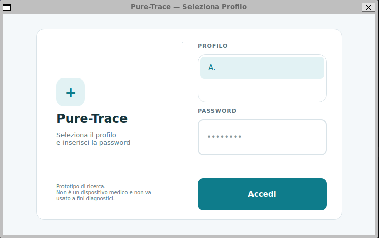
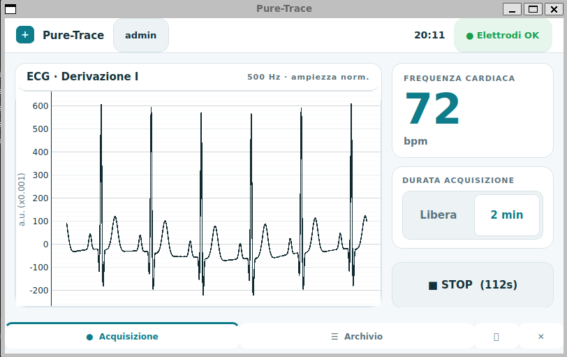
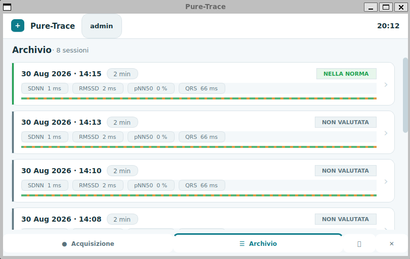
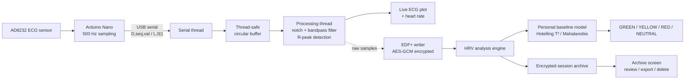

<div align="center">

# Pure-Trace

**An engineering case study in patient-specific cardiac anomaly detection**
Analog & embedded hardware · signal processing · applied statistics · encrypted health data · concurrent systems

[](https://www.python.org/)
[](https://www.raspberrypi.com/)
[](./LICENSE)
[](#️-disclaimer)

`analog-frontend` · `embedded-firmware` · `signal-processing` · `applied-statistics` · `cryptography` · `concurrent-systems` · `emc-shielding` · `desktop-ui`

</div>

<p align="center">
  <!--
    Suggested hero image: a photo of the assembled device (Raspberry Pi +
    touchscreen + Arduino/AD8232 + enclosure) running the acquisition screen.
    docs/screenshots/hero.png — 1200px wide recommended.
  -->
  
</p>

---

## ⚠️ Disclaimer

> **Pure-Trace is a research prototype. It is not a medical device and must
> not be used for diagnostic purposes.** It reports statistical deviations
> from a patient's own historical baseline — it does not diagnose any
> medical condition.

---

## What this is

Pure-Trace is a complete, working system spanning two layers that are
usually built and shown separately: a **physical acquisition device** —
analog front-end, embedded firmware, custom enclosure, power and shielding
design — and a **software pipeline** built on top of it — real-time signal
processing, an applied-statistics scoring model, and an encrypted desktop
application. It was built to answer one specific engineering question: *can
a low-cost single-lead ECG setup detect meaningful, patient-specific
deviations in cardiac variability, end to end, with the same rigor a
production system would need — from the electrode on skin to the number a
clinician reads?*

This README gives the overview — **what was built, why, and where to look
for more.** The full reasoning behind each hardware and software decision
lives in [`docs/deep-dives.md`](docs/deep-dives.md), one write-up per
decision, so this file stays scannable.

## The idea

Commercial wearables flag "abnormal" heart rate variability against
population-wide thresholds — the same cutoff for everyone, regardless of a
person's own baseline physiology. Pure-Trace explores a different approach:
build a **personal, per-patient statistical model** instead, and measure how
much a new recording deviates from *that specific person's own history*
rather than from a population average.

The differentiator is deliberately **not** the hardware. The statistical
layer — feature extraction, per-patient Mahalanobis baseline, Hotelling T²
calibration — is designed to be agnostic to whatever ECG front-end feeds it;
any certified sensor could sit in place of the Arduino/AD8232 used here
without changing the algorithm. Two architectural choices reflect that
intent:

- **Raw signal fidelity is never touched.** Filtering is only ever used for
  on-device display and feature extraction — every export is always the
  unprocessed raw signal, so nothing is lost to on-device processing before
  the data reaches a clinician.
- **Local-first, no-cloud data model.** Every artifact is encrypted and kept
  on the device itself, and sessions export to EDF+, a standard clinical
  format independent of this software.

The hardware side exists to make that idea physically real and physically
*safe* — hence the attention given to power isolation, shielding, and
failure handling, not just to the statistics.

### Device-free UI testing

Set `DEBUG=1` before launching the application to inject a protocol-compatible
Arduino/AD8232 mock. It streams a synthetic 72 bpm ECG and reports connected
electrodes, so recording, live rendering, signal processing, saving, and the
archive all use the same path as the physical device. The mode is opt-in and
must never be used for clinical or sensor validation.

PowerShell:

```powershell
$env:DEBUG = '1'
python -m pure_trace.main
```

## Screenshots

<!--
  Replace the placeholders below with real screenshots once available.
  Suggested shots (docs/screenshots/):
    - device_enclosure.png  -> assembled device, enclosure + shielding baffle
    - profile_login.png     -> profile selector + password screen
    - acquisition_live.png  -> live ECG trace + heart rate during a recording
    - archive_list.png      -> session list with status colors
    - session_detail.png    -> full trace + colored RR strip + metrics grid
-->

<table>
  <tr>
    <td align="center"><b>Assembled device</b></td>
    <td align="center"><b>Login / profile selection</b></td>
  </tr>
  <tr>
    <td></td>
    <td></td>
  </tr>
  <tr>
    <td align="center"><b>Live acquisition</b></td>
    <td align="center"><b>Session archive</b></td>
  </tr>
  <tr>
    <td></td>
    <td></td>
  </tr>
</table>

---

## Table of contents

- [Skills & concepts applied](#skills--concepts-applied)
- [Hardware highlights](#hardware-highlights)
- [Software highlights](#software-highlights)
- [Architecture](#architecture)
- [Design for compliance & patient safety](#design-for-compliance--patient-safety)
- [Privacy & data model](#privacy--data-model)
- [Bill of materials](#bill-of-materials)
- [Tech stack](#tech-stack)
- [Project structure](#project-structure)
- [Production-readiness considerations](#production-readiness-considerations)
- [Full documentation](#full-documentation)

---

## Skills & concepts applied

| Domain | Where it shows up in this project |
|---|---|
| **Analog front-end & power electronics** | Battery-only power delivery for galvanic isolation, boost-converter selection and sizing, hardware high-pass filtering and lead-off detection on the AFE |
| **EMC / signal integrity** | Diagnosing switching-converter EMI coupling onto a flex display cable; designing and building a directional copper shield to attenuate it |
| **Embedded firmware** | Non-blocking serial I/O, drift-free timing via `micros()`, a fault-tolerant serial protocol with sequence numbers |
| **Digital signal processing** | Real-time IIR notch + bandpass filtering with persistent filter state, adaptive R-peak detection, offline vs. streaming filter equivalence |
| **Applied statistics** | Multivariate outlier detection (Mahalanobis distance), correct small-sample calibration (Hotelling T² instead of χ²), robust (median/MAD) z-scoring |
| **Applied cryptography** | AES-GCM authenticated encryption, PBKDF2 key derivation, side-channel-aware design (padding to hide plaintext length) |
| **Concurrent systems** | Producer/consumer threading (serial ↔ processing ↔ UI), a thread-safe circular buffer, a lock-free O(1) sliding-window maximum |
| **Resilient systems design** | Atomic file writes, crash-safe multi-step operations, explicit "missing vs. corrupted" data handling, hardware-level fault detection (leads-off, dropped frames, power loss) |
| **Applied UX & mechanical design** | A touch-first interface for a fixed 800×480 embedded display; a custom 3D-printed enclosure (7×6×3 cm) housing all of the above |

---

## Hardware highlights

The physical layer wasn't treated as a commodity part to buy and forget —
it's where most of the safety and reliability constraints of the project
actually live. Four decisions worth knowing about, each with a full
write-up in [`docs/deep-dives.md`](docs/deep-dives.md):

- **Battery-only power for galvanic isolation** — the device runs
  exclusively on an internal Li-Po battery and is hardware-locked against
  use while charging, so patient isolation from the mains doesn't depend on
  software or configuration to hold.
  → [Full write-up](docs/deep-dives.md#1-choosing-battery-only-power-for-galvanic-isolation)
- **Root-causing an EMI problem on the display cable** — intermittent
  visual noise traced back to the boost converter radiating onto the
  unshielded DSI flex cable, fixed with a custom copper-tape Faraday shield.
  → [Full write-up](docs/deep-dives.md#2-tracing-an-emi-problem-to-its-physical-cause)
- **Two-layer EMC strategy** — physical shielding for internally-generated
  interference, a digital notch filter for externally-picked-up 50 Hz hum;
  each technique matched to the failure mode it actually solves.
  → [Full write-up](docs/deep-dives.md#3-rejecting-the-noise-that-shielding-cant-stop)
- **Firmware built for a link that drops samples** — sequence-numbered
  serial frames and non-blocking I/O mean a dropped sample becomes a known,
  corrected event instead of a silent timebase drift.
  → [Full write-up](docs/deep-dives.md#4-designing-firmware-for-a-link-that-will-drop-samples)

## Software highlights

Six moments where "it works" and "it's actually correct" turned out to be
different questions. Full write-ups, with code pointers, in
[`docs/deep-dives.md`](docs/deep-dives.md):

- **Calibrating baseline thresholds correctly** — a naive χ² threshold on
  the Mahalanobis distance produced ~20% false positives at small sample
  sizes; replaced with two-sample Hotelling T² theory built for estimated,
  not known, parameters.
  → [Full write-up](docs/deep-dives.md#1-calibrating-the-baseline-thresholds-correctly-not-just-plausibly)
- **Deciding what "signal fidelity" means** — real-time R-peak detection
  lags the true peak by a breath-modulated amount; offline "apex snapping"
  cut RMSSD error from ~5% to ~1%.
  → [Full write-up](docs/deep-dives.md#2-deciding-what-signal-fidelity-actually-means)
- **Not leaking data through metadata** — encrypted files still leak beat
  count through ciphertext length; fixed-size padding closes that side
  channel.
  → [Full write-up](docs/deep-dives.md#3-not-leaking-data-through-metadata)
- **"No data" vs. "corrupted data"** — a decrypt failure on the baseline
  file could silently look like "no baseline yet" and overwrite months of
  patient history; a strict-mode reader prevents that.
  → [Full write-up](docs/deep-dives.md#4-treating-no-data-and-corrupted-data-as-different-failure-modes)
- **O(1) real-time performance on constrained hardware** — a monotonic
  deque replaces a per-sample O(window) max computation for R-peak
  detection on the Raspberry Pi.
  → [Full write-up](docs/deep-dives.md#5-real-time-performance-on-hardware-that-doesnt-have-much-to-spare)
- **Designing for a field that will go wrong** — atomic file writes,
  staged profile creation, and gap interpolation so a mid-write power loss
  or a dropped sample never corrupts patient data.
  → [Full write-up](docs/deep-dives.md#6-assuming-the-field-will-go-wrong-because-it-will)

## Architecture



The AD8232 front-end amplifies the ECG signal and exposes a leads-off
status; the Arduino samples both at 500 Hz and streams them over serial with
a sequence counter. The desktop app filters the live signal for display and
detection only, while the raw trace is what actually gets saved. On stop,
the session is encrypted, written as EDF+, and analyzed offline: HRV metrics
are computed, checked against the patient's baseline once enough history
exists, and the result is archived alongside the recording. The battery,
boost converter, and shielding baffle from the
[hardware highlights](#hardware-highlights) sit physically upstream of
block **A**, outside this data-flow diagram but load-bearing for the whole
system's safety.

## Design for compliance & patient safety

This prototype was designed *mimicking* the underlying logic of IEC 60601-1
and GDPR/HIPAA — it is **not certified against either**, and none of what
follows should be read as a compliance claim. It's a description of which
design decisions were shaped by which principle.

Electric shock risk is the concern IEC 60601-1 centers on, and it's
addressed here with battery-only power that's hardware-interlocked against
use while charging, so patient isolation from the mains doesn't depend on
software to hold ([hardware highlight](#hardware-highlights)). Radiated EMI,
covered by IEC 60601-1-2, is handled with a grounded copper shielding
baffle around the boost converter, while conducted and ambient EMI is
rejected with a digital 50 Hz notch filter — two different techniques for
two different coupling paths.

On the data side, GDPR and HIPAA both expect that personal and health data
at rest be protected against unauthorized access with measures appropriate
to the risk; here that means AES-128-GCM encryption with padding against
metadata leakage. Both frameworks also expect risk-appropriate safeguards
against accidental loss or corruption; that's addressed with atomic writes
and strict corrupted-vs-missing handling, so a crash mid-write can't
silently destroy a patient's history.

## Privacy & data model

Health data handling was treated as a first-class design constraint, not an
add-on:

- Each profile is password-protected (PBKDF2-HMAC-SHA256, 200,000
  iterations) → a profile-specific AES-128-GCM key; the password itself is
  never stored.
- The patient's real name, the raw ECG, HRV metrics, and the baseline model
  are all encrypted at rest. Only a non-identifying alias is ever shown
  before login.
- Exporting a session for external clinical tools produces a **plaintext**
  file by necessity — the app surfaces an explicit warning before doing so,
  since protection becomes the user's responsibility from that point on.

*(`secure_store.py`, `data_layer.py`.)*

## Bill of materials

The physical layer was kept deliberately low-cost, to validate the
statistical and data pipeline without waiting on certified hardware.

| Component | Function | Approx. cost |
|---|---|---|
| Raspberry Pi 4B (8 GB) | Compute unit, DSP & UI hosting | $75 |
| Arduino Nano (CH340) | 500 Hz ADC & serial streaming | $5 |
| AD8232 breakout | Analog signal conditioning & lead-off detection | $10 |
| Waveshare 4.3" MIPI DSI | 800×480 capacitive UI display | $40 |
| Li-Po battery (5000 mAh) | Internal power / galvanic isolation | $15 |
| IP5328P boost module | 3.7 V → 5 V power regulation (18 W) | $5 |

Housed in a custom 3D-printed enclosure (7×6×3 cm) with the copper shielding
baffle described in the [hardware highlights](#hardware-highlights) mounted
between the boost converter and the display flex cable.

## Tech stack

`Python` · `PyQt5` + `pyqtgraph` (UI/plotting) · `NumPy` / `SciPy` (DSP) ·
`cryptography` (AES-GCM, PBKDF2) · `pyedflib` (EDF+ clinical format) ·
`pyserial` · `Arduino C++` (firmware)

## Project structure

```
pure-trace/
├── firmware/pure_trace_firmware.ino   # Arduino sketch (ECG front-end)
├── hardware/                          # enclosure CAD, shielding baffle, power notes
├── pure_trace/                        # application package
│   ├── main.py, config.py
│   ├── data_layer.py, secure_store.py       # profiles, encryption, EDF+
│   ├── analysis_engine.py                   # HRV analysis + baseline model
│   ├── signal_processing.py, serial_port.py # real-time DSP + serial I/O
│   ├── logging_setup.py
│   └── ui/                                  # PyQt5 screens + design system
├── tools/create_profile.py
├── docs/
│   ├── deep-dives.md                  # full hardware + software write-ups
│   └── screenshots/
└── requirements.txt
```

Full breakdown of every file, by responsibility, is in the
[technical documentation](#full-documentation).

## Production-readiness considerations

Built with hobbyist-grade parts on purpose, to validate the pipeline and the
statistical layer without waiting on certified hardware. What follows are
choices tied to *this specific build*, not to the underlying approach — a
production version would swap components rather than solve these in place:

- **Not a diagnostic tool** — reports relative deviations from a personal
  baseline, not medical conditions, by design.
- **This sensor isn't mV-calibrated.** The AD8232 used for the demo doesn't
  provide a calibrated analog output; the app states this explicitly rather
  than implying a precision the hardware doesn't have. A certified front-end
  would provide a calibrated signal with no change to the software
  downstream — the statistical layer only ever consumes derived features.
- **EMI shielding is bespoke, not certified.** The copper-tape baffle solves
  the specific coupling path observed in this enclosure; a production
  design would need formal EMC testing (radiated + conducted) rather than a
  single hand-built fix.
- **Secure deletion is a mitigation, not a guarantee** on SD/SSD media with
  wear leveling — a property of the storage medium, independent of the
  encryption scheme itself.

## Full documentation

- **[`docs/deep-dives.md`](docs/deep-dives.md)** — full write-ups of every
  hardware and software decision summarized above, in English, with code
  pointers.
- **[`docs/Pure-Trace_documentazione.md`](docs/Complete_Project_Documentation.md)**
  — a complete theory + code walkthrough (in Italian), covering every
  design decision file by file, in more depth than fits here.

---

<div align="center">

**Michele Bufis** · [LinkedIn](https://www.linkedin.com/in/michele-pasquale-bufis-7362242a0) · michelebufis2002@gmail.com

<sub>Built as a research prototype exploring analog/embedded hardware, signal processing, applied statistics, and secure data handling.</sub>

</div>
